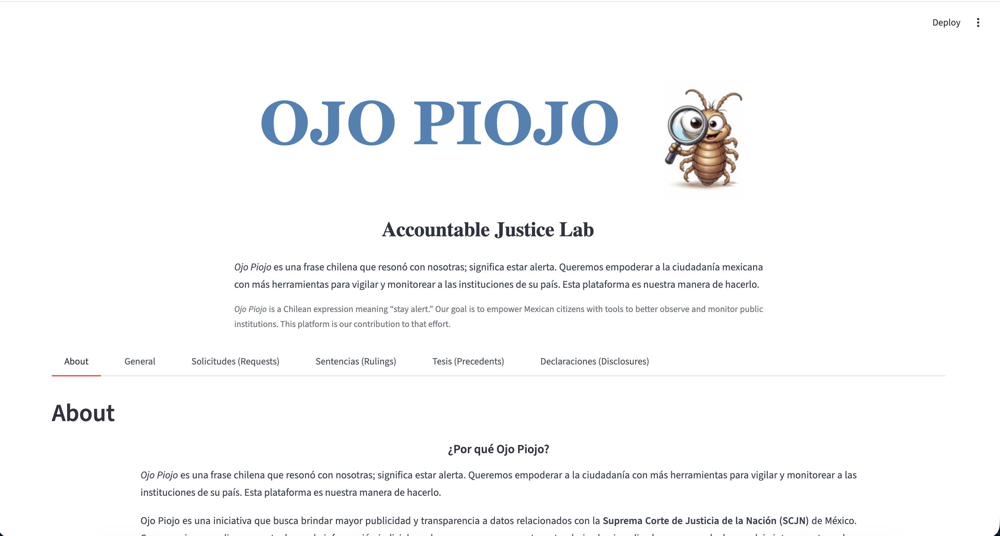

Accountable justice lab (Ojo Piojo) is an initiative that promotes transparency and accessibility of data related to the Mexican Supreme Court (SCJN). We found that judicial information is often not standardized or analyzed at scale, leaving important questions about how the court and its members operate. Our goal is to empower Mexican citizens with tools to better observe and monitor public institutions. Ojo Piojo is our contribution to that effort.

{< youtube Dxhgxxyba-0 >}



