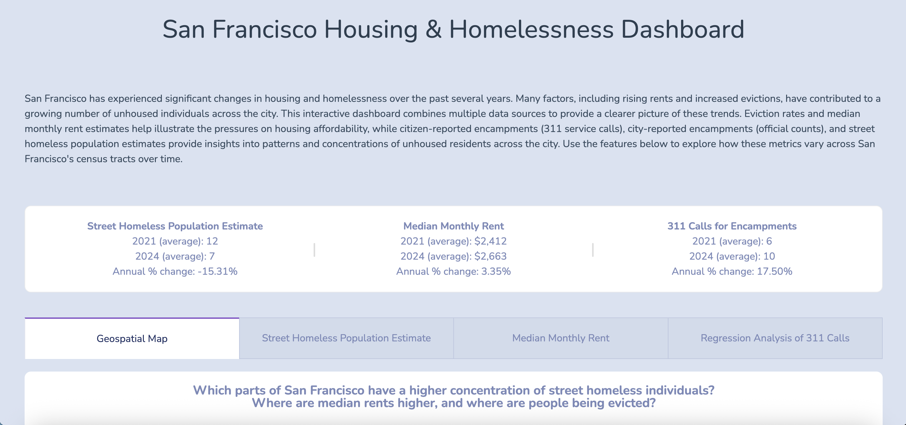

Several cities in the United States are experiencing a homelessness crisis, with San Francisco often cited due to its high housing prices and limited housing supply. Our project examines tract-level homelessness and housing indicators in San Francisco from 2020 to 2024. We aligned multiple datasets onto the same spatial-temporal scale, aggregating and interpolating point-level data (quarterly encampment counts, daily 311 calls, and daily eviction reports) to census tracts by month. We also disaggregated monthly ZIP code-level median rent data to census tracts by weighting with HUD crosswalks and normalizing with ACS baseline values.

Using multipliers from the literature applied to encampment counts, we generated tract-level estimates of the street homeless population. These estimates and metrics were integrated into an interactive dashboard featuring: (1) a choropleth map showing metrics by tract and month; (2) line graphs of street homelessness and the distribution of tents, structures, and vehicles for a selected census tract; (3) a line graph of monthly median rent that updates by ZIP code; and (4) a regression analysis linking 311 calls to tract-level characteristics.

Overall, our dashboard highlights spatial and temporal patterns in homelessness and housing, helping policymakers and community organizations better target interventions, allocate resources, and make informed housing policy decisions.



