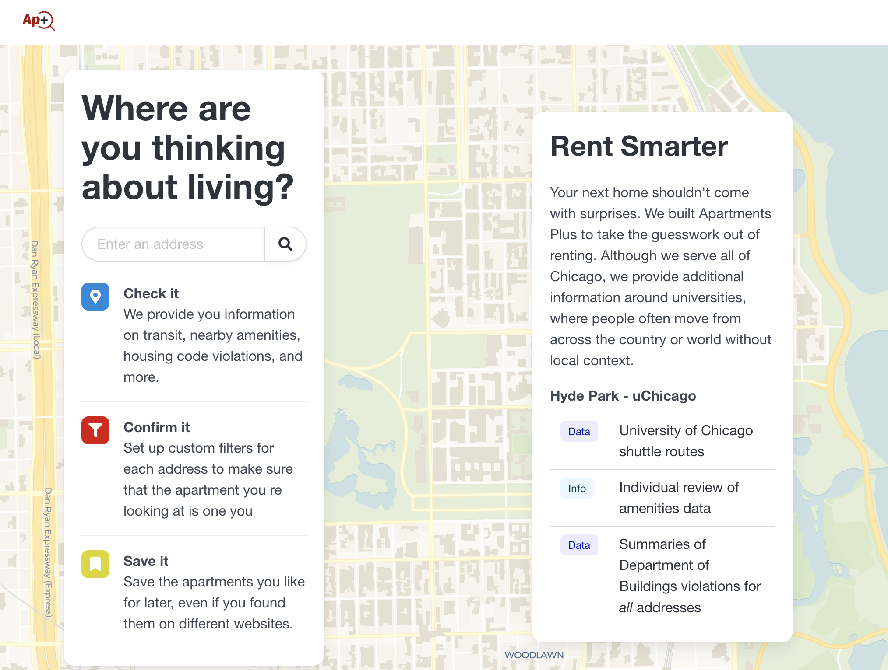

Tenants struggle to navigate scattered information when searching for a new apartment. Without a centralized solution to aggregate key information, renters must take significant time to research or risk unforeseen downsides. This is exacerbated by popular commercial platforms' incentive to hide negative aspects of their listings. As generalist platforms, they also lack granularity in neighborhood details, for example, a distance to grocery stores known to local residents.

Apartments Plus aggregates data that mainstream rental sites often do not display, such as building defects and landlord reputations. Apartments Plus currently has data on Chicago, with a special focus on tenants in university neighborhoods like Hyde Park, which welcome a steady influx of new tenants every year.

We're online at [aptpl.us](https://aptpl.us).



