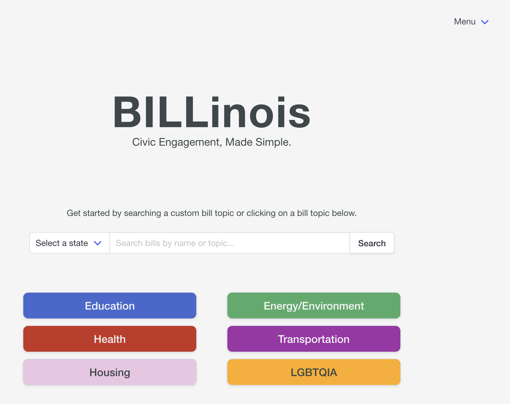

A friendly civic engagement tool that notifies users about their favorite bills. BILLinois allows users to search bills by name or by topic, view additional information about each bill including a summary of the bill, a tracker of its status, and its sponsors, and login to add bills of interest and sign up for notifications about those bills of interest. The live site is now available at <https://billinoisapp.com>.

BILLinois's initial focus is on the Illinois General Assembly, but a long-term goal of the project is to expand either to additional states or to additional levels of government. The website is also set up to include legislation from the Indiana General Assembly, and bills for either state can be searched for using the "Select a state" dropdown. However, the primary focus of the tool at this point remains on the Illinois General Assembly.



