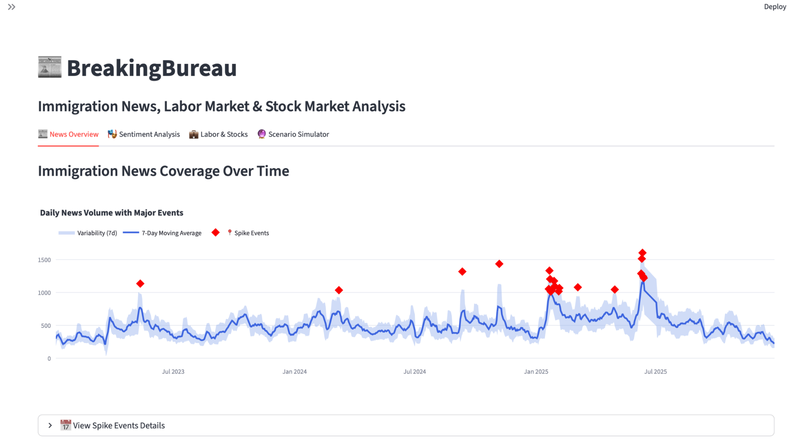

Title: BreakingBureau
Subtitle: Immigration News, Labor Market & Stock Market Analysis.
Description: A data analysis project examining the relationship between immigration-related news coverage and U.S. economic indicators.



