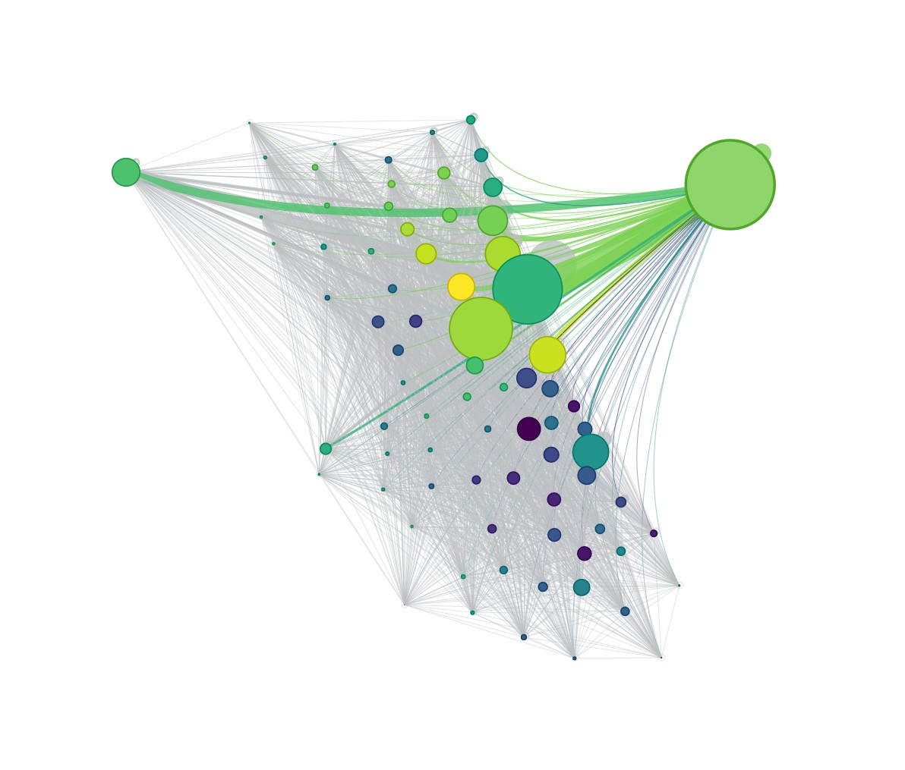

Project Name: Chicago Transportation Need and Mobility Patterns

This project examines mobility patterns in Chicago for 2024, exploring how public transit usage, rideshare activity, and neighborhood-level characteristics vary across the city.



