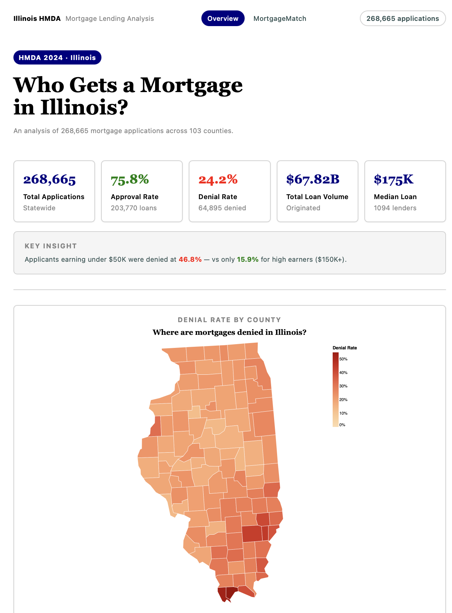

MortgageMatch is an interactive Illinois mortgage dashboard built from public data. It combines HMDA application records, Census county indicators, and HMDA lender data to show patterns in mortgage approvals and denials across borrowers, locations, and lenders. The project downloads and cleans the data, standardizes county and lender IDs, creates analysis variables like approval outcome, income bands, and loan amount bands, and merges everything into one dataset. Users can explore the results with filters such as age and income range, and view approval and denial patterns by county, lender, income band, loan purpose, and loan amount.

{< youtube 2Lru3lukzRI >}



