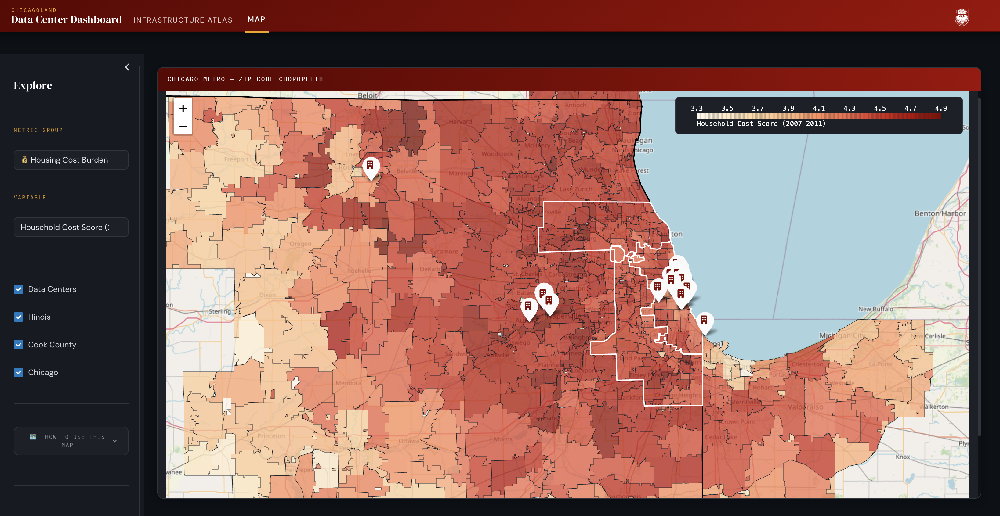

Data Centers Next Door analyzes how the development of data centers may affect housing conditions in the Chicagoland area. The project combines datasets on data center locations, housing prices, and housing cost indicators to examine changes before and after facilities receive operating permits. Using a reproducible data pipeline and interactive visualizations, the analysis explores whether communities near data centers experience shifts in housing prices or affordability.



