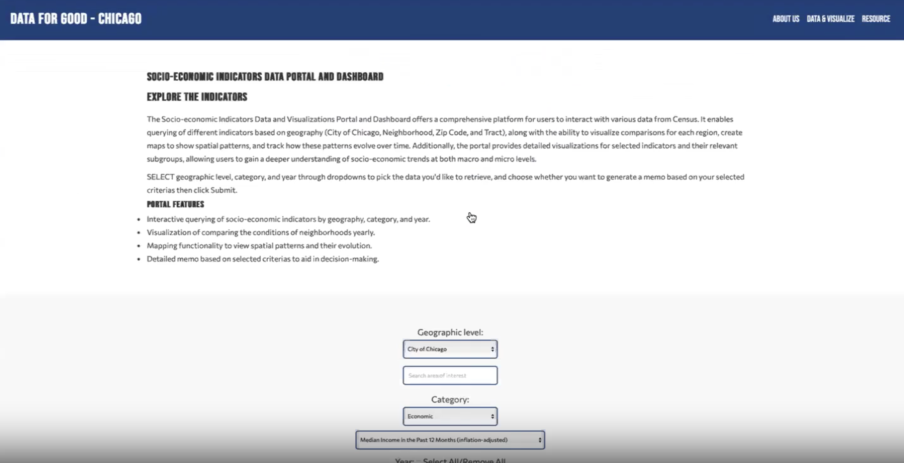



The main objective of our web application is to help small and medium-sized nonprofits collect, analyze, and use Census data efficiently to achieve their goals. By using advanced technologies like Python, GIS mapping, and data science techniques, including natural language processing and AI, the application will allow nonprofits to easily access and use the city's resources and information, plan strategically, and make data-driven decisions without needing extensive technical skills.

Key components include:

- Data and Dashboard: Select variables and indicators for analysis, generate interactive visualizations, and customizable dashboards for comprehensive insights.
- Automated Memo Generation: Summarize key insights from data and visuals, generate ready-to-use memos or paragraphs.
- Maps and City Resources: Explore and navigate city resources using integrated ArcGIS Online functionality.

Overall, the application aims to bridge the gap between data availability, accessibility, and its effective utilization by nonprofit organizations. It seeks to empower nonprofits to make informed decisions, optimize resource navigation and allocation, and enhance their impact on the communities they serve.

