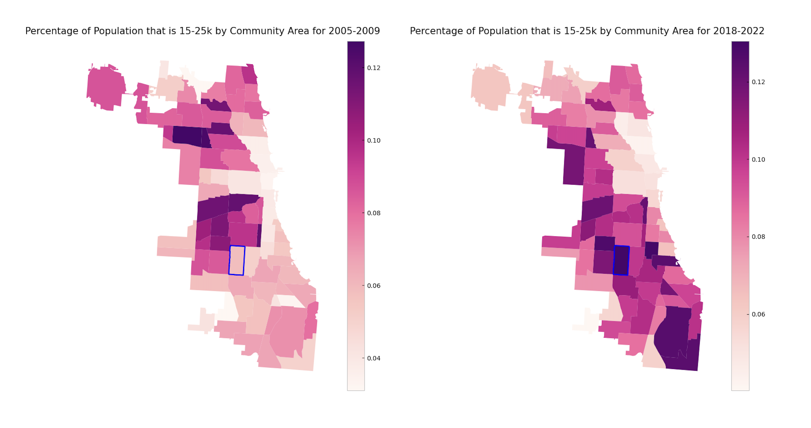

This project studies demographic change in Chicago community areas in relationship with fluctuations in the housing and economic markets. Specifically, the goal of this project was to study the biggest demographic shifts in Chicago and study potential causes behind those changes. To this end, we gathered demographic data using the United States Census American Community Survey (ACS) API and housing/economic data from a number of secondary sources, including the DePaul Housing Institute, the City of Chicago, and the Law Center for Better Housing.

Using a fuzzy geomatching algorithm, we grouped our tract-level Census data into community area data. When run as an app, this project allows a user to study the biggest demographic shifts out of all Chicago neighborhoods, visualize these changes, and investigate contemperaneous change in housing or economic measurements.



