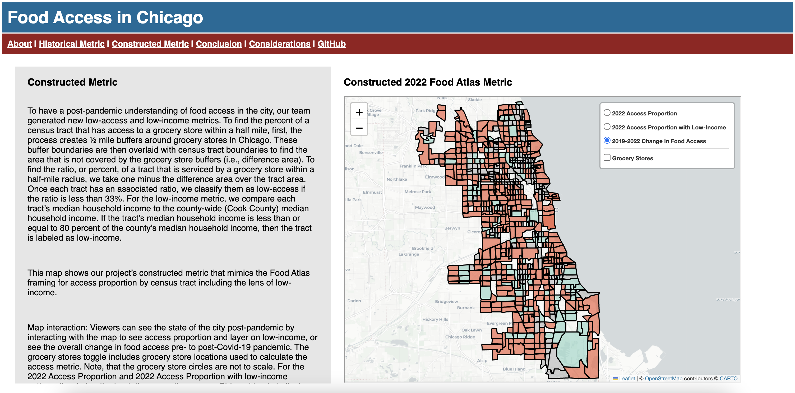

The project aims to analyze food access within the Chicago area. The scope of this work provides an updated food access metric for 2022 to understand communities’ post-pandemic food access and shows how food access has changed in the city over time. The Atlas Food Access Research data from 2010, 2015, and 2019 is used as a historic food access metric. To recreate the 2022 metric, grocery store data from the City of Chicago are paired with household income information from the United States Census. For understanding and consumption, the project findings are presented in a Dash web application containing several interactive maps using Folium.



