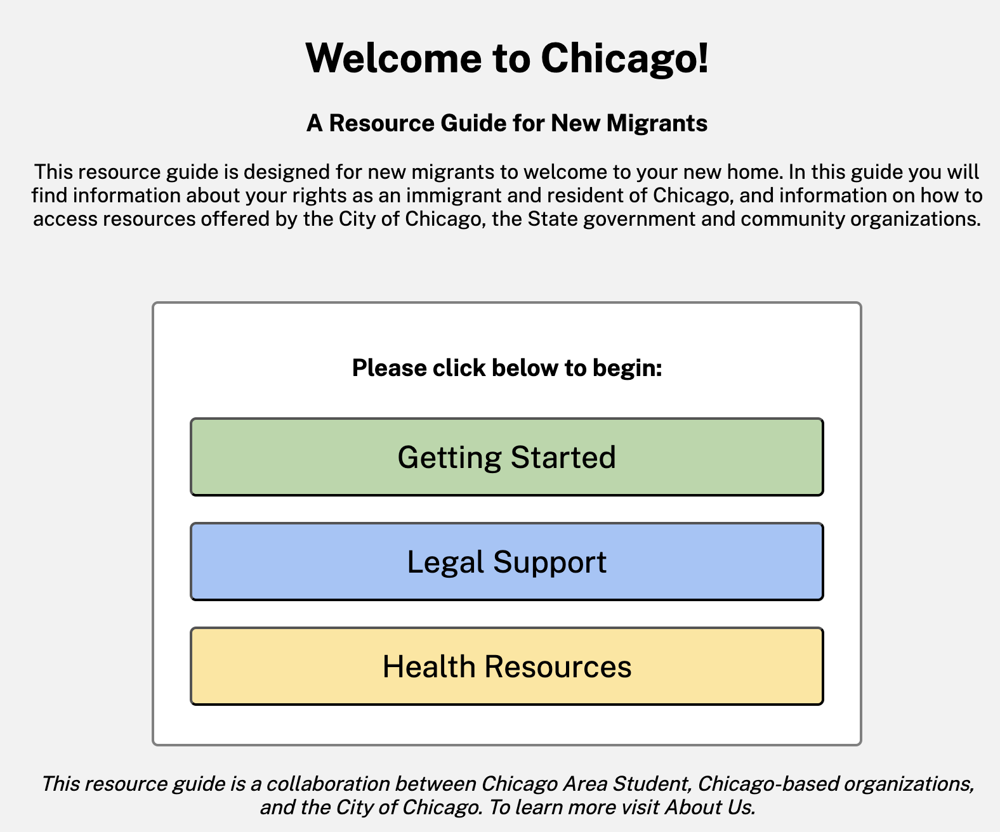



New Arrivals Chi is a resource guide developed by six graduate students from the University of Chicago to help newly arrived individuals navigate the City of Chicago and its available resources. New Migrants often find themselves struggling with the complexities of accessing essential resources, from navigating systems to staying updated on what's available. Our goal is to provide accurate, up-to-date, and actionable information to address common challenges faced by newcomers.

The public facing site includes a guide for getting started in Chicago, legal support and health information. It also includes a two tiered login structure that allows organization to login and update their information, and site administrators to login and manage all organizations.

**TA**: Michael Plunkett

