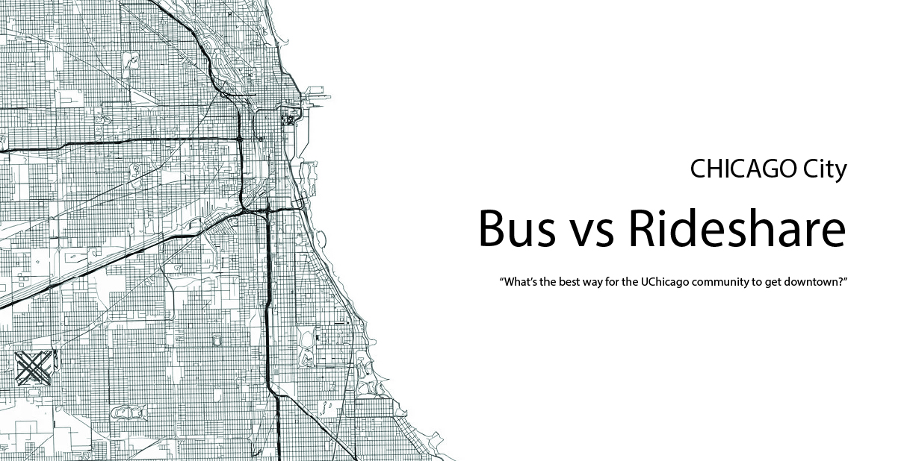

Video: <https://drive.google.com/file/d/1ikeWle0SJ1wfsB1ja4a-vO9gqnyAOB9A/view>

Bus vs. Rideshare: What's the Best Way for the UChicago Community to Get Downtown?

This project provides practical insights into the factors shaping transportation choices among the University of Chicago community traveling between Hyde Park and Downtown Chicago. We compare the two primary CTA bus routes serving this corridor (routes 2 and 6) with rideshare options (Uber and Lyft), focusing on travel time and cost.



