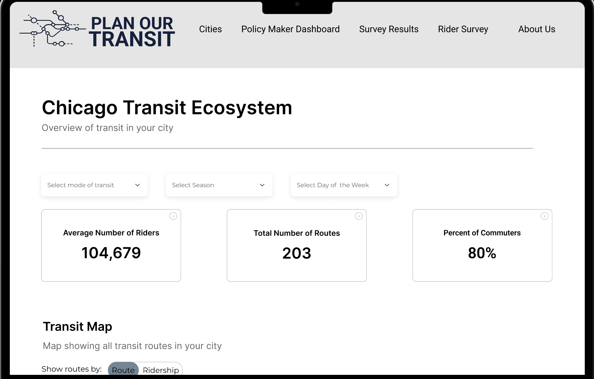



The transit planning tool aims to revitalize public interest and participation in transit, driving increased ridership and creating more efficient networks that meet urban community needs. Learn about the City Transit Ecosystem! Show us routes that you would like in your neighborhood! Currently, we are working in New York, Chicago and Portland.

This tool will help City Planners and Locals alike as they:

- Utilize data analytics to help facilitate a data informed transit planning process.
- Collect feedback to gain insights into rider preferences.
- Provide increased transparency in the route planning process.

