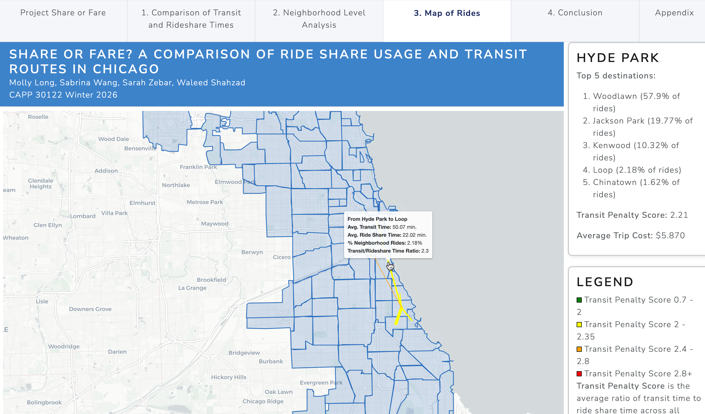

This project explores Chicago rideshare data and public transit alternatives to rideshare rides. We aim to explore when, where, and why Chicagoans choose rideshare instead of public transportation. We also aim to identify common rideshare trips that do not have a reasonable public transportation alternative, which can inform future transit planning and creation of new CTA routes.



