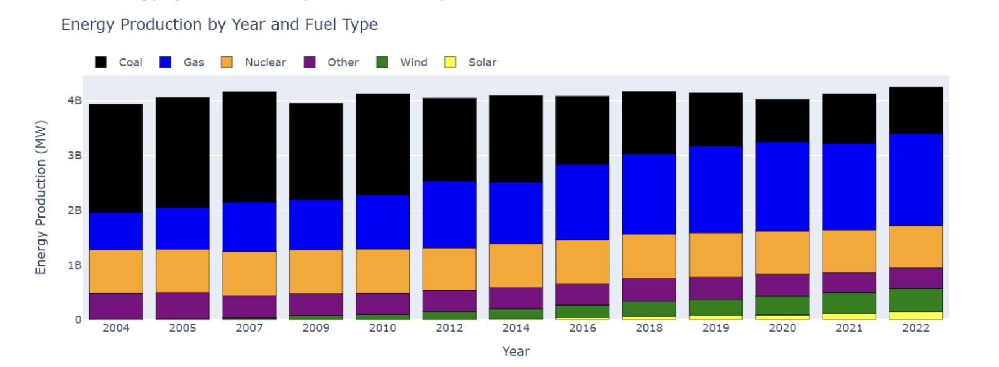

This project aggregates and analyzes data to builds interactive visualizations on electricity generation in the United States. It seeks explore the relationship between sources energy (renewable vs non-renewable), energy prices, and C02 emissions across states and across time.



